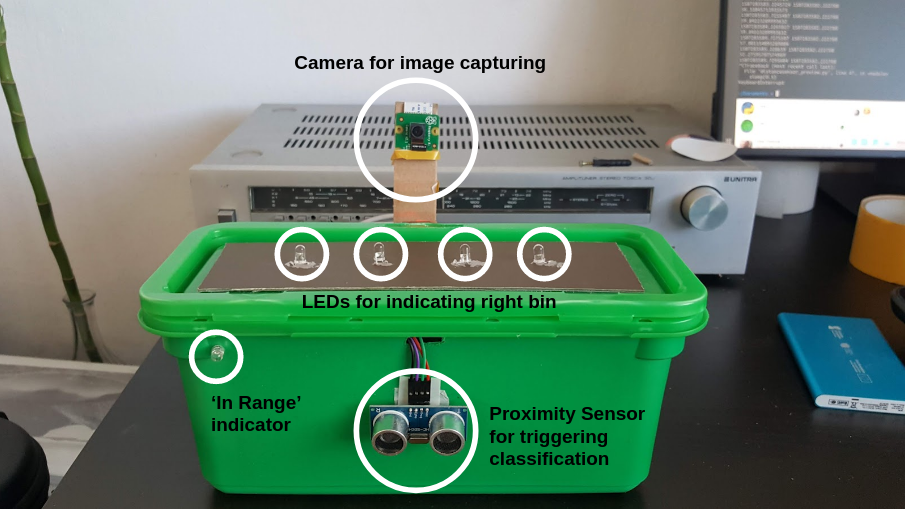
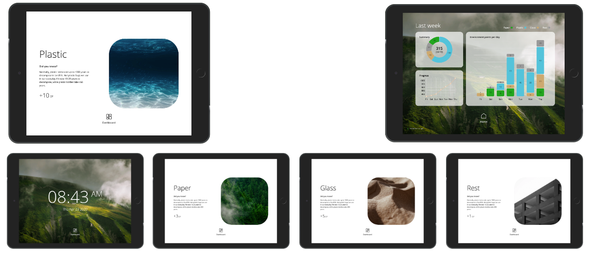

# Garbage Detector

This repository consist of elements that make up Garbage Detector - an AI-powered waste sorting trash bin contributing to saving our planet.

## Premise

The world is drowning in trash. Correct way to segregate it in the source of origin is the key for efficient upstream processing and reducing the negative impact on our environment.
Even though we realize that, we often lack focus or knowledge to do it right. Imagine a trash bin that will do the thinking for you.

## Architecture

### Raspberry Pi

Our smart bin is a device powered by Raspberry Pi with several integrations, namely:

* **Rasbperry Pi Camera HD tv2** - capturing images for classification
* **HC-SR04 Proximity Sensor** - calculating distance to the device to establish triggering moment
* **4 x LEDs on top (green, red, yellow, blue)** - indicating separate sorting fractions
* **1 x LED in front (green)** - indicating if user is `in range` of the device

#### Prototype

### Garbage Detector - App

The app lies within `garbage_detector`. It's a fully configurable, simple process orchestrating interaction between
user, classification mechanism and notification mechanism.

#### Classifiers

Currently following classifiers are supported:

##### Tensorflow Serving

Tensorflow Serving is a service enabling accessing Tensorflow Models through REST API.

It is configurable through `tfsevring` section.

If you have Tensorflow Serving instance with classification model deployed, you can make configure Garbage Detector to classify your images with it's REST API endpoint.

##### [GCP AutoML Vision](https://cloud.google.com/vision/overview/docs#automl-vision)

GCP AutoML Vision is a MLaaS offering in Google Cloud Platform, providing easy way to train and deploy your model.

It's configurable through `gcp.automl` section.

If your classification model was deployed to AutoML Vision, you can configure Garbage Detector to use it for classifying images.

##### [GCP AI](https://cloud.google.com/products/ai)

GCP AI is a offering from Google Cloud Platform enabling you to deploy your tensorflow/keras/scikit model to cloud.
After deploying your model to GCP AI it is accessible in a similar way than Tensorflow Serving.

It's configurable through `gcp.ai` section.

If you deployed your model to GCP AI, configure Garbage Classification to make classifications it's REST API endpoint.

##### [GCP Cloud Vision](https://cloud.google.com/vision/docs)

GCP Cloud Vision is a product from Google Cloud Platform providing ready-to-use state-of-the-art model for image classification and object recognition.

With this product, he classification is semi-automatic - we query model for `object detection` predictions and maintain dictionary mapping them to particular sorting fractions.

### Garbage Detector - Web App

### Garbage Detector - Model

### Demo

Click for the youtube video:

### Contributors

* @FGhavamian
* @nielsdenissen
* @podolskipio
* @swian
* @tjinauyeung
* @tomcis
* @twalen
